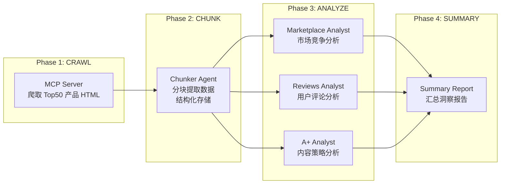

<div align="center">

# Amazon-Bestsellers-Summary

*一键分析 Amazon Bestsellers Top50 类目，三维度洞察市场竞争格局。*

[](https://code.claude.com/claude-code)
[](LICENSE)
[](https://www.python.org/)

> **Claude-Code-Plugin** | **MCP Server** | **Multi-Agent** | **MIT License**

</div>

---

<div align="center">

**🌐 Language / 语言**

[**简体中文**](README.md) | [English](README_en.md)

</div>

---

## 痛点

你是否经历过这些分析困境？

| 场景 | 结果 |
|------|------|
| 手动收集 Amazon Top50 产品数据 | 耗时数天，数据零散难以整合 |
| 不知道如何分析市场竞争格局 | 缺乏系统框架，分析流于表面 |
| 用户评论数据量大且杂乱 | 无法提炼有价值的用户洞察 |
| A+ 内容素材分散 | 难以总结竞品内容策略 |

**Amazon-Bestsellers-Summary** 提供全流程自动化解决方案：从爬虫抓取 → 分块提取 → 三维度分析 → 汇总报告，一条命令完成所有工作。

---

## 核心功能

### 三维度分析体系

```
┌───────────────────────────────────────────────────────────────┐
│  Marketplace 维度：市场竞争格局分析                             │
│  Reviews 维度：用户评论情感与需求洞察                            │
│  A+ Content 维度：产品详情页内容策略分析                         │
└───────────────────────────────────────────────────────────────┘
```

| 维度 | 分析内容 |
|------|---------|
| **Marketplace** | 价格分布、评分分布、排名变化、品牌集中度、新品机会 |
| **Reviews** | 情感分析、用户痛点、需求趋势、好评/差评关键词 |
| **A+ Content** | 图片数量、文案风格、卖点呈现、视觉策略 |

---

## 工作流程



---

## 插件结构

```
amazon-bestsellers-summary/
├── .claude-plugin/
│   └── plugin.json          # 插件元数据
├── agents/                  # Agent 定义
│   ├── amazon-bestsellers-orchestrator.md   # 顶层编排器
│   ├── amazon-product-chunker.md            # 数据分块提取
│   ├── amazon-bestsellers-marketplace-analyst.md  # 市场分析
│   ├── amazon-bestsellers-reviews-analyst.md       # 评论分析
│   ├── amazon-bestsellers-aplus-analyst.md        # A+内容分析
│   └── amazon-bestsellers-fine-grained-analyst.md # 细分类分析
├── skills/                  # Skill 定义
│   ├── amazon-extractor/    # 数据提取技能
│   ├── amazon-test-chunker/ # 测试分块技能
│   ├── amazon-bestsellers-aplus-dim/        # A+维度技能
│   ├── amazon-bestsellers-marketplace-dim/  # 市场维度技能
│   ├── amazon-bestsellers-reviews-dim/      # 评论维度技能
│   └── amazon-bestsellers-fine-grained-dim/ # 细分类维度技能
├── scraper/                 # MCP Server
│   ├── mcp_server.py        # MCP 服务入口
│   ├── raw_amazon_spider.py # 爬虫实现
│   └── requirements.txt     # Python 依赖
└── README.md
```

---

## 安装与使用

### 方式：作为主会话启动 Orchestrator（支持多 Agent 调度）

> **重要**：Claude Code 的 subagent 无法嵌套 spawn 其他 subagent。要让 orchestrator 调度子 agent（chunker + 四个 analyst），必须将其作为**主会话**启动：

```bash
claude --plugin-dir /your/path/to/amazon-bestsellers-summary --agent amazon-bestsellers-summary:amazon-bestsellers-orchestrator --dangerously-skip-permissions
```

参数说明：
- `--plugin-dir` → 指向插件根目录（包含 `.claude-plugin/plugin.json` 的目录）
- `--agent amazon-bestsellers-summary:amazon-bestsellers-orchestrator` → 格式为 `plugin-name:agent-name`，plugin-name 来自 `plugin.json` 中的 `name` 字段
- `--dangerously-skip-permissions` → 跳过权限检查，允许主会话调用所有工具（！必须要有，否则不会创建Agent进行工作）

### 使用示例

**方式一启动后**，在 Claude Code 中输入：

```
请你帮我生成一份 womens-hoodies 细分类目的整体报告
```

**方式二启动后**，orchestrator 已作为主会话运行，直接输入任务即可：

```
分析这个类目的 Bestsellers Top50：
https://www.amazon.com/gp/bestsellers/fashion/1040658/
```

插件将自动：
1. 调用 MCP Server 爬取 Top50 产品数据
2. Spawn chunker agent 进行分块提取
3. 并行 Spawn 四个 analyst agent 进行维度分析
4. 汇总生成 summary 报告

---

## 输出示例

分析完成后，将在 workspace 目录下生成：

```
workspace/womens-hoodies/
├── chunks/                  # 分块数据
│   ├── 0001_B0XXXXX/       # 产品分块
│   └── global_manifest.json
├── reports/                 # 分析报告
│   ├── marketplace_dim.md   # 市场竞争分析
│   ├── reviews_dim.md       # 用户评论分析
│   ├── aplus_dim.md         # A+内容分析
│   └── fine_grained_dim.md  # 细分类分析
└── summary.md               # 汇总报告
```

---

## Agent 说明

| Agent | 职责 |
|-------|------|
| `amazon-bestsellers-orchestrator` | 顶层编排器，协调整个流水线 |
| `amazon-product-chunker` | 数据分块与结构化提取 |
| `amazon-bestsellers-marketplace-analyst` | 市场竞争维度分析 |
| `amazon-bestsellers-reviews-analyst` | 用户评论维度分析 |
| `amazon-bestsellers-aplus-analyst` | A+内容维度分析 |
| `amazon-bestsellers-fine-grained-analyst` | 细分类维度分析 |

---

## 依赖要求

- **Claude Code** >= 1.0.0
- **Python** >= 3.10
- **Playwright** (用于爬虫)

---

## 常见问题

### Q: 爬虫无法启动？

确保已安装 Playwright 浏览器：
```bash
playwright install chromium
```

### Q: 如何查看已安装的插件？

```bash
/plugin
```

### Q: 如何重新加载插件？

```bash
/reload-plugins
```

---

## 致谢

本插件基于以下技术构建：

- **[Claude Code](https://code.claude.com)** — Anthropic 官方 AI 编程助手
- **[MCP Protocol](https://modelcontextprotocol.io)** — Model Context Protocol
- **[Playwright](https://playwright.dev)** — 浏览器自动化框架

---

## License

MIT License
