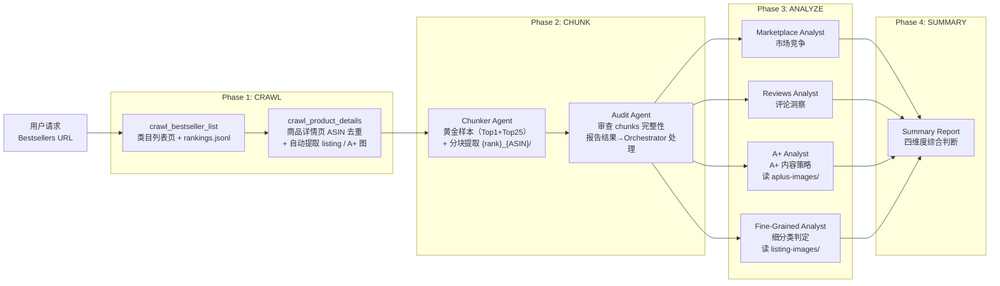

<div align="center">

# Amazon-Bestsellers-Summary

*一键分析 Amazon Bestsellers Top50 类目，四维度洞察市场竞争格局。*

[](https://code.claude.com/claude-code)
[](LICENSE)
[](https://www.python.org/)

> **Claude-Code-Plugin** | **MCP Server** | **Multi-Agent** | **MIT License**

</div>

---

<div align="center">

**🌐 Language / 语言**

[**简体中文**](README.md) | [English](README_en.md)

</div>

---

## 痛点

你是否经历过这些分析困境？

| 场景 | 结果 |
|------|------|
| 手动收集 Amazon Top50 产品数据 | 耗时数天，数据零散难以整合 |
| 不知道如何分析市场竞争格局 | 缺乏系统框架，分析流于表面 |
| 用户评论数据量大且杂乱 | 无法提炼有价值的用户洞察 |
| A+ 内容素材分散 | 难以总结竞品内容策略 |

**Amazon-Bestsellers-Summary** 提供全流程自动化解决方案：从爬虫抓取 → 分块提取 → 四维度分析 → 汇总报告，一条命令完成所有工作。

---

## 核心功能

### 四维度分析体系

```
┌───────────────────────────────────────────────────────────────┐
│  Marketplace 维度：市场竞争格局分析                            │
│  Reviews 维度：用户评论情感与需求洞察                          │
│  A+ Content 维度：产品详情页内容策略分析                       │
│  Fine-Grained 维度：Top50 逐商品细分类与机会判断               │
└───────────────────────────────────────────────────────────────┘
```

| 维度 | 分析内容 |
|------|---------|
| **Marketplace** | 价格分布、评分分布、排名变化、品牌集中度、新品机会 |
| **Reviews** | 情感分析、用户痛点、需求趋势、好评/差评关键词 |
| **A+ Content** | 模块结构、视觉策略、Comparison Table、品牌故事、A+ 质量分层 |
| **Fine-Grained** | 细分类标签（L1/L2）、证据链、分布统计、标签空档与拥挤区 |

---

## 工作流程



**关键设计**：
- **类目以 Browse Node ID (codied) 命名**：从 Bestsellers URL 尾部抽取的纯数字，如 `11058221`，作为 `category_slug`，禁止模型自己起名
- **URL 必须包含类目名**：Amazon 不接受纯数字 ID 的 URL（`/gp/bestsellers/11058221/` 无法访问），必须提供完整 URL 如 `/gp/bestsellers/beauty/11058221/`
- **products/ 是全局 ASIN 仓库**：按 ASIN 去重，MCP 默认跳过已爬过的 ASIN，不会重复请求
- **categories/{browse_node_id}/rankings.jsonl**：append-only 排名日志，每次运行追加一行，可追踪排名变化
- **图片由 MCP 统一负责**：`crawl_product_details` 时自动提取 listing + A+ 图到 `products/{ASIN}/` 下，agent 只读取不下载

---

## 插件结构

```
amazon-bestsellers-summary/
├── .claude-plugin/
│   └── plugin.json                                  # 插件元数据
├── agents/                                          # Agent 定义
│   ├── amazon-bestsellers-orchestrator.md           # 顶层编排器
│   ├── amazon-product-chunker.md                    # 数据分块提取
│   ├── amazon-chunker-audit.md                      # chunks 完整性审查
│   ├── amazon-bestsellers-marketplace-analyst.md    # 市场分析
│   ├── amazon-bestsellers-reviews-analyst.md        # 评论分析
│   ├── amazon-bestsellers-aplus-analyst.md          # A+ 内容分析
│   └── amazon-bestsellers-fine-grained-analyst.md   # 细分类分析
├── skills/                                          # Skill 定义
│   ├── amazon-chunker/                              # 分块技能
│   ├── amazon-extractor/                            # 数据提取技能
│   ├── amazon-test-chunker/                         # TDD & Golden Fixture
│   ├── amazon-bestsellers-marketplace-dim/          # 市场维度技能
│   ├── amazon-bestsellers-reviews-dim/              # 评论维度技能
│   ├── amazon-bestsellers-aplus-dim/                # A+ 维度技能
│   └── amazon-bestsellers-fine-grained-dim/         # 细分类维度技能
├── scraper/                                         # MCP Server + 爬虫
│   ├── mcp_server.py                                # MCP 服务入口（4 个工具）
│   ├── category_spider.py                           # 类目列表页爬虫
│   ├── product_spider.py                            # 商品详情页爬虫（ASIN 去重）
│   ├── extract_listing_images.py                    # Listing 图提取
│   ├── extract_aplus.py                             # A+ 图 + 结构化内容提取
│   ├── downloader.py                                # 通用图片下载工具
│   └── requirements.txt                             # Python 依赖
├── chunker/                                         # chunker 主代码（由 chunker agent 产出至 workspace）
└── README.md
```

### MCP 工具

`scraper/mcp_server.py` 对外暴露 4 个工具：

| 工具 | 作用 |
|---|---|
| `crawl_bestseller_list` | 爬取 Bestsellers 类目列表页，写入 `{workspace}/categories/{browse_node_id}/` |
| `crawl_product_details` | 爬取商品详情页（ASIN 去重），默认串联执行 listing + A+ 图提取 |
| `extract_listing_images` | 补跑单个 ASIN 的 listing 图提取（用本地缓存的 product.html） |
| `extract_aplus_images` | 补跑单个 ASIN 的 A+ 图提取（含 `aplus_extracted.md`） |

---

## 安装与使用

### 方式：作为主会话启动 Orchestrator（支持多 Agent 调度）

> **重要**：Claude Code 的 subagent 无法嵌套 spawn 其他 subagent。要让 orchestrator 调度子 agent（chunker + 四个 analyst），必须将其作为**主会话**启动：

```bash
claude --plugin-dir /your/path/to/amazon-bestsellers-summary-agent --agent amazon-bestsellers-summary:amazon-bestsellers-orchestrator --dangerously-skip-permissions
```

参数说明：
- `--plugin-dir` → 指向插件根目录（包含 `.claude-plugin/plugin.json` 的目录）
- `--agent amazon-bestsellers-summary:amazon-bestsellers-orchestrator` → 格式为 `plugin-name:agent-name`，plugin-name 来自 `plugin.json` 中的 `name` 字段
- `--dangerously-skip-permissions` → 跳过权限检查，允许主会话调用所有工具（！必须要有，否则不会创建Agent进行工作）

### 使用示例

启动后，在 Claude Code 中输入 Amazon Bestsellers 类目 URL：

```
分析这个类目的 Bestsellers Top50：
https://www.amazon.com/gp/bestsellers/fashion/1040658/
```

> ⚠️ 必须提供 **完整的 Bestsellers URL**（含类目名），而不是纯数字 ID 或类目名称。Amazon 不接受纯数字 ID 的 URL，URL 中必须包含类目名（如 `beauty`、`fashion`），例如 `https://www.amazon.com/gp/bestsellers/beauty/11058221/`。URL 尾部的数字就是 Browse Node ID (codied)，会被作为 `category_slug` 和 workspace 目录名。

插件将自动：
1. 调用 MCP Server 爬取 Top50 产品数据
2. Spawn chunker agent 生成黄金样本并进行分块提取
3. Spawn audit agent 审查 chunks 完整性；若缺漏则重启 chunker 补跑
4. 并行 Spawn 四个 analyst agent 进行维度分析
5. 汇总生成 summary 报告

---

## 输出示例

分析完成后，将在 workspace 目录下生成（以 `1040658` 为例）：

```
workspace/1040658/                                ← {browse_node_id} (codied)
├── categories/
│   └── 1040658/
│       ├── category_001.html                     # 类目列表页 HTML
│       ├── meta.json                             # 类目元信息
│       └── rankings.jsonl                        # 排名快照（append-only）
├── products/                                     # 全局 ASIN 仓库
│   ├── B0XXXXX/
│   │   ├── product.html                          # 详情页原始 HTML
│   │   ├── meta.json
│   │   ├── listing-images/
│   │   │   ├── urls.json
│   │   │   └── images/listing_img_001.jpg ...
│   │   └── aplus-images/
│   │       ├── urls.json
│   │       ├── aplus_extracted.md
│   │       ├── aplus.html
│   │       └── images/aplus_img_001.png ...
│   └── B0YYYYY/...
├── golden/                                       # 黄金样本（由 chunker agent LLM 清洗，与 chunks 独立）
│   ├── {Top1_ASIN}/
│   │   ├── ppd/ppd_golden.md
│   │   ├── customer_reviews/customer_reviews_golden.md
│   │   ├── product_details/product_details_golden.md
│   │   └── aplus/aplus_golden.md
│   └── {Top25_ASIN}/...
├── chunks/
│   ├── 001_B0XXXXX/                              # {rank}_{ASIN}（rank 来自 rankings.jsonl）
│   │   ├── manifest.json
│   │   ├── ppd/raw/ppd.html + extract/ppd_extracted.md
│   │   ├── customer_reviews/...
│   │   ├── product_details/...
│   │   └── aplus/...
│   └── global_manifest.json
├── audit_report.json                             # 由 audit agent 生成的审查报告
├── chunker/                                      # 由 chunker agent 生成的可复用提取器代码
├── tests/                                        # 由 chunker agent 生成的回归测试
├── reports/
│   ├── 1040658_marketplace_dim.md  + .json
│   ├── 1040658_reviews_dim.md      + .json
│   ├── 1040658_aplus_dim.md        + .json
│   └── 1040658_fine_grained_dim.md + .json
└── summary.md                                    # 四维度综合判断
```

---

## Agent 说明

| Agent | 职责 | 输入 | 输出 |
|-------|------|------|------|
| `amazon-bestsellers-orchestrator` | 顶层编排器，协调整个流水线 | 类目 URL | 调度 + `summary.md` |
| `amazon-product-chunker` | 数据分块与结构化提取（含黄金样本生成） | `products/{ASIN}/product.html` + `rankings.jsonl` | `golden/{ASIN}/` + `chunks/{rank}_{ASIN}/` |
| `amazon-chunker-audit` | 审查 chunks 完整性，返回审查结果（缺漏由 orchestrator 重启 chunker 补跑） | `chunks/` + `golden/` | `audit_report.json` |
| `amazon-bestsellers-marketplace-analyst` | 市场竞争维度分析 | `ppd/` + `product_details/` | `{browse_node_id}_marketplace_dim.{md,json}` |
| `amazon-bestsellers-reviews-analyst` | 用户评论维度分析 | `customer_reviews/` | `{browse_node_id}_reviews_dim.{md,json}` |
| `amazon-bestsellers-aplus-analyst` | A+ 内容维度分析 | `aplus/` + `products/{ASIN}/aplus-images/` | `{browse_node_id}_aplus_dim.{md,json}` |
| `amazon-bestsellers-fine-grained-analyst` | 细分类维度分析 | `ppd/` + `product_details/` + `products/{ASIN}/listing-images/` | `{browse_node_id}_fine_grained_dim.{md,json}` |

---

## 依赖要求

- **Claude Code** >= 1.0.0
- **Python** >= 3.10
- **Playwright** (用于爬虫)

---

## 常见问题

### Q: 爬虫无法启动？

确保已安装 Playwright 浏览器：
```bash
playwright install chromium
```

### Q: 如何查看已安装的插件？

```bash
/plugin
```

### Q: 如何重新加载插件？

```bash
/reload-plugins
```

---

## 致谢

本插件基于以下技术构建：

- **[Claude Code](https://code.claude.com)** — Anthropic 官方 AI 编程助手
- **[MCP Protocol](https://modelcontextprotocol.io)** — Model Context Protocol
- **[Playwright](https://playwright.dev)** — 浏览器自动化框架

---

## License

MIT License
