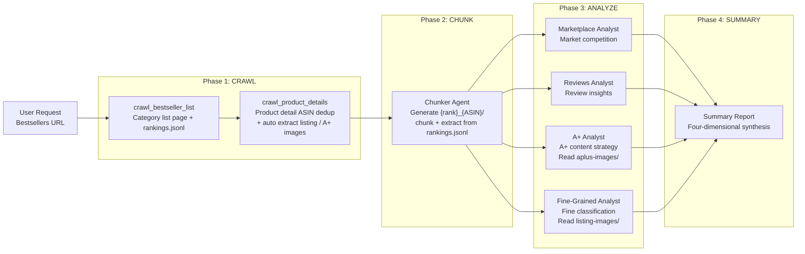

<div align="center">

# Amazon-Bestsellers-Summary

*One-click analysis of Amazon Bestsellers Top50 categories with four-dimensional market insights.*

[](https://code.claude.com/claude-code)
[](LICENSE)
[](https://www.python.org/)

> **Claude-Code-Plugin** | **MCP Server** | **Multi-Agent** | **MIT License**

</div>

---

<div align="center">

**🌐 Language / 语言**

[简体中文](README.md) | [**English**](README_en.md)

</div>

---

## Pain Points

Have you ever faced these analysis dilemmas?

| Scenario | Result |
|----------|--------|
| Manually collecting Amazon Top50 product data | Days of work, scattered data hard to integrate |
| Unsure how to analyze market competition | No systematic framework, superficial analysis |
| Large and messy user review data | Unable to extract valuable user insights |
| A+ content materials scattered | Hard to summarize competitor content strategies |

**Amazon-Bestsellers-Summary** provides a fully automated solution: from crawling → chunking → four-dimensional analysis → summary report, all in one command.

---

## Core Features

### Four-Dimensional Analysis System

```
┌───────────────────────────────────────────────────────────────┐
│  Marketplace Dimension: Market competition landscape analysis │
│  Reviews Dimension: User sentiment and needs insights         │
│  A+ Content Dimension: Product page content strategy        │
│  Fine-Grained Dimension: Per-product fine classification      │
└───────────────────────────────────────────────────────────────┘
```

| Dimension | Analysis Content |
|-----------|------------------|
| **Marketplace** | Price distribution, rating distribution, ranking changes, brand concentration, new product opportunities |
| **Reviews** | Sentiment analysis, user pain points, demand trends, positive/negative keywords |
| **A+ Content** | Module structure, visual strategy, Comparison Table, brand story, A+ quality tiers |
| **Fine-Grained** | Fine-grained tags (L1/L2), evidence chains, distribution stats, tag gaps and crowded zones |

---

## Workflow



**Key Design**:
- **Categories are named by Browse Node ID (codied)**: Pure numeric ID extracted from the tail of the Bestsellers URL, e.g. `1040658`, used as `category_slug`. Model-generated names are forbidden.
- **`products/` is the global ASIN warehouse**: ASIN-deduplicated; MCP skips already-crawled ASINs by default and will not re-request.
- **`categories/{browse_node_id}/rankings.jsonl`**: Append-only ranking log; each run appends one line, enabling ranking change tracking.
- **Images are managed uniformly by MCP**: `crawl_product_details` automatically extracts listing + A+ images under `products/{ASIN}/`; agents only read, never download.

---

## Plugin Structure

```
amazon-bestsellers-summary/
├── .claude-plugin/
│   └── plugin.json                                  # Plugin metadata
├── agents/                                          # Agent definitions
│   ├── amazon-bestsellers-orchestrator.md           # Top-level orchestrator
│   ├── amazon-product-chunker.md                    # Data chunking & extraction
│   ├── amazon-bestsellers-marketplace-analyst.md    # Market analysis
│   ├── amazon-bestsellers-reviews-analyst.md        # Review analysis
│   ├── amazon-bestsellers-aplus-analyst.md          # A+ content analysis
│   └── amazon-bestsellers-fine-grained-analyst.md   # Fine-grained analysis
├── skills/                                          # Skill definitions
│   ├── amazon-chunker/                              # Chunking skills
│   ├── amazon-extractor/                            # Data extraction skills
│   ├── amazon-test-chunker/                         # TDD & Golden Fixture
│   ├── amazon-bestsellers-marketplace-dim/          # Marketplace dimension skills
│   ├── amazon-bestsellers-reviews-dim/              # Reviews dimension skills
│   ├── amazon-bestsellers-aplus-dim/                # A+ dimension skills
│   └── amazon-bestsellers-fine-grained-dim/         # Fine-grained dimension skills
├── scraper/                                         # MCP Server + crawlers
│   ├── mcp_server.py                                # MCP service entry (4 tools)
│   ├── category_spider.py                           # Category list page crawler
│   ├── product_spider.py                            # Product detail crawler (ASIN dedup)
│   ├── extract_listing_images.py                    # Listing image extraction
│   ├── extract_aplus.py                             # A+ image + structured content extraction
│   ├── downloader.py                                # Generic image downloader
│   └── requirements.txt                             # Python dependencies
├── chunker/                                         # Chunker main code (produced by chunker agent into workspace)
└── README.md
```

### MCP Tools

`scraper/mcp_server.py` exposes 4 tools:

| Tool | Purpose |
|------|---------|
| `crawl_bestseller_list` | Crawl Bestsellers category list page, write to `{workspace}/categories/{browse_node_id}/` |
| `crawl_product_details` | Crawl product detail pages (ASIN dedup); by default chains listing + A+ image extraction |
| `extract_listing_images` | Re-run listing image extraction for a single ASIN (uses locally cached product.html) |
| `extract_aplus_images` | Re-run A+ image extraction for a single ASIN (includes `aplus_extracted.md`) |

---

## Installation & Usage

### Method: Launch Orchestrator as Main Session (Supports Multi-Agent Orchestration)

> **Important**: Claude Code subagents cannot nest and spawn other subagents. To allow the orchestrator to dispatch child agents (chunker + four analysts), it must be launched as a **main session**:

```bash
claude --plugin-dir /your/path/to/amazon-bestsellers-summary --agent amazon-bestsellers-summary:amazon-bestsellers-orchestrator --dangerously-skip-permissions
```

Parameter explanation:
- `--plugin-dir` → Points to the plugin root directory (the directory containing `.claude-plugin/plugin.json`)
- `--agent amazon-bestsellers-summary:amazon-bestsellers-orchestrator` → Format is `plugin-name:agent-name`, where plugin-name comes from the `name` field in `plugin.json`
- `--dangerously-skip-permissions` → Skips permission checks, allowing the main session to call all tools (! Required, otherwise Agents will not be created to work)

### Usage Example

After startup, enter the Amazon Bestsellers category URL in Claude Code:

```
Analyze the Bestsellers Top50 for this category:
https://www.amazon.com/gp/bestsellers/fashion/1040658/
```

> ⚠️ You must provide a **Bestsellers URL**, not a human-readable category name. The number at the tail of the URL (`1040658` in this example) is the Browse Node ID (codied), which will be used as `category_slug` and the workspace directory name.

The plugin will automatically:
1. Call MCP Server to crawl Top50 product data
2. Spawn chunker agent for chunking and extraction
3. Parallel spawn four analyst agents for dimensional analysis
4. Generate consolidated summary report

---

## Output Example

After analysis completes, the following will be generated under the workspace directory (using `1040658` as an example):

```
workspace/1040658/                                ← {browse_node_id} (codied)
├── categories/
│   └── 1040658/
│       ├── category_001.html                     # Category list page HTML
│       ├── meta.json                             # Category metadata
│       └── rankings.jsonl                        # Ranking snapshot (append-only)
├── products/                                     # Global ASIN warehouse
│   ├── B0XXXXX/
│   │   ├── product.html                          # Detail page raw HTML
│   │   ├── meta.json
│   │   ├── listing-images/
│   │   │   ├── urls.json
│   │   │   └── images/listing_img_001.jpg ...
│   │   └── aplus-images/
│   │       ├── urls.json
│   │       ├── aplus_extracted.md
│   │       ├── aplus.html
│   │       └── images/aplus_img_001.png ...
│   └── B0YYYYY/...
├── chunks/
│   ├── 001_B0XXXXX/                              # {rank}_{ASIN} (rank from rankings.jsonl)
│   │   ├── manifest.json
│   │   ├── ppd/raw/ppd.html + extract/ppd_extracted.md
│   │   ├── customer_reviews/...
│   │   ├── product_details/...
│   │   └── aplus/...
│   └── global_manifest.json
├── chunker/                                      # Reusable extractor code generated by chunker agent
├── tests/                                        # Regression tests generated by chunker agent
├── reports/
│   ├── 1040658_marketplace_dim.md  + .json
│   ├── 1040658_reviews_dim.md      + .json
│   ├── 1040658_aplus_dim.md        + .json
│   └── 1040658_fine_grained_dim.md + .json
└── summary.md                                    # Four-dimensional synthesis
```

---

## Agent Reference

| Agent | Responsibility | Input | Output |
|-------|--------------|-------|--------|
| `amazon-bestsellers-orchestrator` | Top-level orchestrator, coordinates the entire pipeline | Category URL | Scheduling + `summary.md` |
| `amazon-product-chunker` | Data chunking and structured extraction | `products/{ASIN}/product.html` + `rankings.jsonl` | `chunks/{rank}_{ASIN}/` |
| `amazon-bestsellers-marketplace-analyst` | Market competition dimension analysis | `ppd/` + `product_details/` | `{browse_node_id}_marketplace_dim.{md,json}` |
| `amazon-bestsellers-reviews-analyst` | User review dimension analysis | `customer_reviews/` | `{browse_node_id}_reviews_dim.{md,json}` |
| `amazon-bestsellers-aplus-analyst` | A+ content dimension analysis | `aplus/` + `products/{ASIN}/aplus-images/` | `{browse_node_id}_aplus_dim.{md,json}` |
| `amazon-bestsellers-fine-grained-analyst` | Fine-grained dimension analysis | `ppd/` + `product_details/` + `products/{ASIN}/listing-images/` | `{browse_node_id}_fine_grained_dim.{md,json}` |

---

## Requirements

- **Claude Code** >= 1.0.0
- **Python** >= 3.10
- **Playwright** (for crawler)

---

## FAQ

### Q: Crawler won't start?

Make sure Playwright browser is installed:
```bash
playwright install chromium
```

### Q: How to view installed plugins?

```bash
/plugin
```

### Q: How to reload plugins?

```bash
/reload-plugins
```

---

## Acknowledgments

This plugin is built on the following technologies:

- **[Claude Code](https://code.claude.com)** — Anthropic official AI coding assistant
- **[MCP Protocol](https://modelcontextprotocol.io)** — Model Context Protocol
- **[Playwright](https://playwright.dev)** — Browser automation framework

---

## License

MIT License
