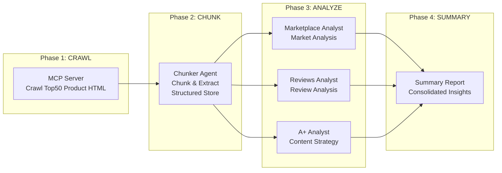

<div align="center">

# Amazon-Bestsellers-Summary

*One-click analysis of Amazon Bestsellers Top50 categories with three-dimensional market insights.*

[](https://code.claude.com/claude-code)
[](LICENSE)
[](https://www.python.org/)

> **Claude-Code-Plugin** | **MCP Server** | **Multi-Agent** | **MIT License**

</div>

---

<div align="center">

**🌐 Language / 语言**

[简体中文](README.md) | [**English**](README_en.md)

</div>

---

## The Problem

Are you struggling with these analysis challenges?

| Scenario | Result |
|----------|--------|
| Manually collecting Amazon Top50 product data | Days of work, scattered data hard to integrate |
| Unsure how to analyze market competition | No systematic framework, superficial analysis |
| Large and messy user review data | Unable to extract valuable user insights |
| Scattered A+ content materials | Hard to summarize competitor content strategies |

**Amazon-Bestsellers-Summary** provides a fully automated solution: from crawling → chunking → three-dimensional analysis → summary report, all in one command.

---

## Core Features

### Three-Dimensional Analysis System

```
┌───────────────────────────────────────────────────────────────┐
│  Marketplace Dimension: Market competition landscape analysis │
│  Reviews Dimension: User sentiment and needs insights         │
│  A+ Content Dimension: Product page content strategy analysis │
└───────────────────────────────────────────────────────────────┘
```

| Dimension | Analysis Content |
|-----------|-----------------|
| **Marketplace** | Price distribution, rating distribution, ranking changes, brand concentration, new product opportunities |
| **Reviews** | Sentiment analysis, user pain points, demand trends, positive/negative keywords |
| **A+ Content** | Image count, copy style, selling point presentation, visual strategy |

---

## Workflow



---

## Plugin Structure

```
amazon-bestsellers-summary/
├── .claude-plugin/
│   └── plugin.json          # Plugin metadata
├── agents/                  # Agent definitions
│   ├── amazon-bestsellers-orchestrator.md   # Top-level orchestrator
│   ├── amazon-product-chunker.md            # Data chunking & extraction
│   ├── amazon-bestsellers-marketplace-analyst.md  # Market analysis
│   ├── amazon-bestsellers-reviews-analyst.md       # Review analysis
│   └── amazon-bestsellers-aplus-analyst.md        # A+ content analysis
├── skills/                  # Skill definitions
│   ├── amazon-extractor/    # Data extraction skills
│   ├── amazon-test-chunker/ # Test chunking skills
│   ├── amazon-bestsellers-aplus-dim/        # A+ dimension skills
│   ├── amazon-bestsellers-marketplace-dim/  # Marketplace dimension skills
│   └── amazon-bestsellers-reviews-dim/      # Reviews dimension skills
├── scraper/                 # MCP Server
│   ├── mcp_server.py        # MCP service entry
│   ├── raw_amazon_spider.py # Spider implementation
│   └── requirements.txt     # Python dependencies
└── README.md
```

---

## Installation & Usage

### Method 1: Local Path Installation (Recommended)

1. **Clone or download this project**

2. **Install Python dependencies**
```bash
cd amazon-bestsellers-summary/scraper
pip install -r requirements.txt
```

3. **Add local marketplace in Claude Code**
```bash
/plugin marketplace add ./amazon-bestsellers-summary
```

4. **Install the plugin**
```bash
/plugin install amazon-bestsellers-summary@amazon-bestsellers-summary
```

### Method 2: Direct Plugin Directory

```bash
claude --plugin-dir ./amazon-bestsellers-summary
```

### Usage Example

After installation, enter in Claude Code:

```
Please generate an overall report for the womens-hoodies subcategory
```

Or:

```
Analyze the Bestsellers Top50 for this category:
https://www.amazon.com/gp/bestsellers/fashion/1040658/
```

The plugin will automatically:
1. Call MCP Server to crawl Top50 product data
2. Chunk and extract structured data
3. Perform three-dimensional analysis (marketplace/reviews/A+ content)
4. Generate summary report

---

## Output Example

After analysis, the following will be generated in the workspace directory:

```
workspace/womens-hoodies/
├── chunks/                  # Chunked data
│   ├── 0001_B0XXXXX/       # Product chunks
│   └── global_manifest.json
├── reports/                 # Analysis reports
│   ├── marketplace_dim.md   # Market competition analysis
│   ├── reviews_dim.md       # User review analysis
│   └── aplus_dim.md         # A+ content analysis
└── summary.md               # Summary report
```

---

## Agent Reference

| Agent | Responsibility |
|-------|---------------|
| `amazon-bestsellers-orchestrator` | Top-level orchestrator, coordinates the entire pipeline |
| `amazon-product-chunker` | Data chunking and structured extraction |
| `amazon-bestsellers-marketplace-analyst` | Market competition dimension analysis |
| `amazon-bestsellers-reviews-analyst` | User review dimension analysis |
| `amazon-bestsellers-aplus-analyst` | A+ content dimension analysis |

---

## Requirements

- **Claude Code** >= 1.0.0
- **Python** >= 3.10
- **Playwright** (for crawler)

---

## FAQ

### Q: Crawler won't start?

Make sure Playwright browser is installed:
```bash
playwright install chromium
```

### Q: How to view installed plugins?

```bash
/plugin
```

### Q: How to reload plugins?

```bash
/reload-plugins
```

---

## Acknowledgments

This plugin is built on the following technologies:

- **[Claude Code](https://code.claude.com)** — Official Anthropic AI coding assistant
- **[MCP Protocol](https://modelcontextprotocol.io)** — Model Context Protocol
- **[Playwright](https://playwright.dev)** — Browser automation framework

---

## License

MIT License
